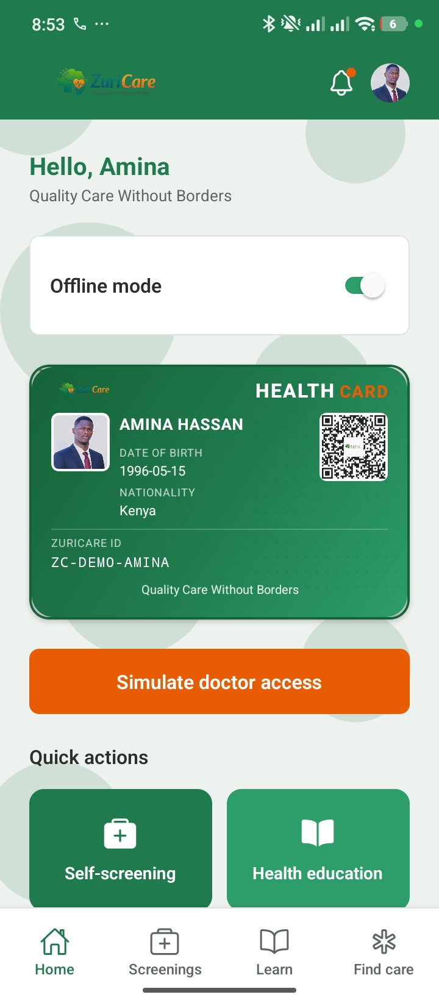
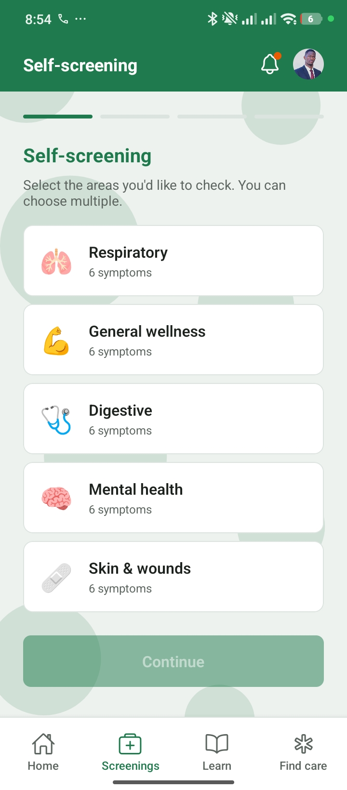
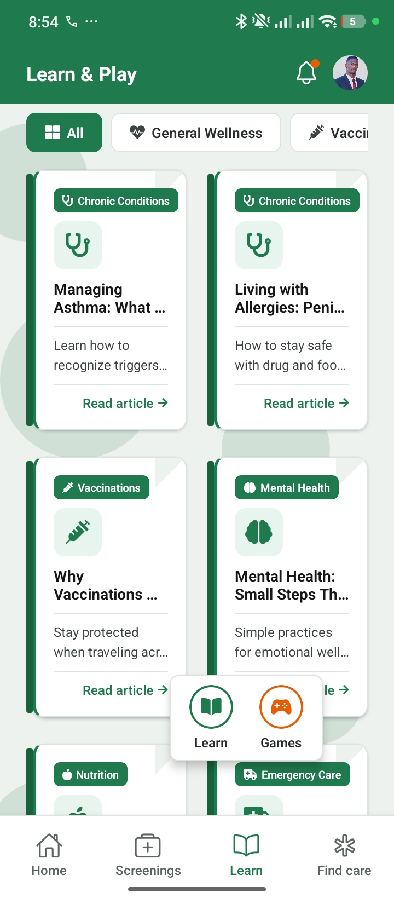
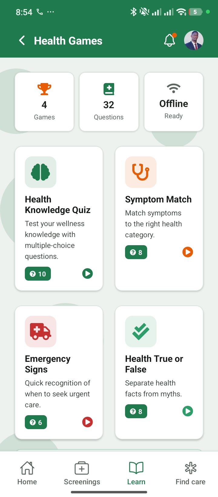
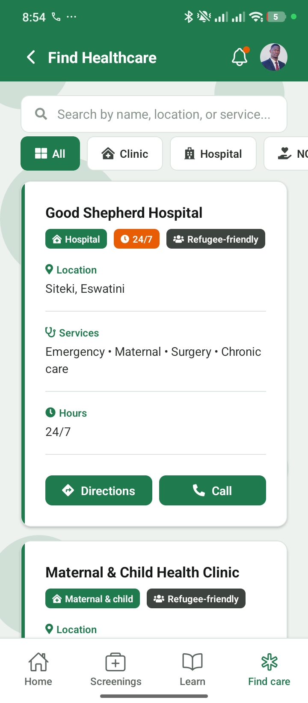
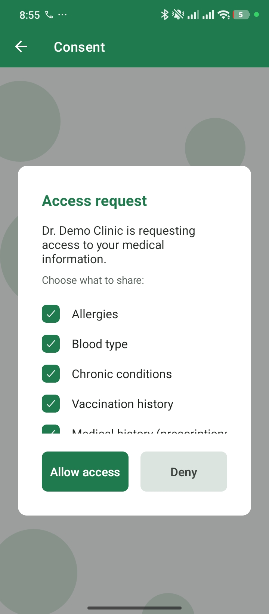
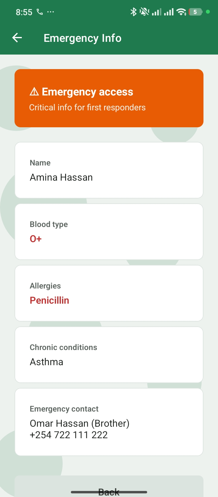
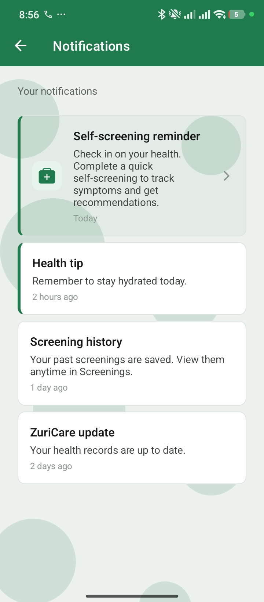

# ZuriCare

**Privacy-first digital health identity for refugees and international patients in Eastern and Southern Africa.**

ZuriCare is a cross-border healthcare ecosystem comprising a **patient mobile app** and **healthcare worker dashboard**. It enables consent-based sharing of medical information, self-screening, health education, and clinic management—designed for low-connectivity environments and aligned with MOSIP digital identity standards.

---

## Features

### Patient Mobile App (Expo/React Native)
- **Digital health identity** — ZuriCare ID and QR code for quick identification
- **Consent-based data sharing** — Patients control what health data they share with providers
- **Self-screening** — Symptom and risk assessment tools
- **Health education** — Articles and resources for patients
- **Medical summary** — View allergies, blood type, chronic conditions, vaccinations, prescriptions
- **Emergency info** — Critical info for first responders (no consent required)
- **Audit log** — Full transparency of who accessed your data
- **Offline-first** — Works with limited or no connectivity

### Backend API (Node.js + Express)
- Patient authentication (ZuriCare ID + PIN)
- Patient profiles and health data
- Consent request/response flow
- Screening history
- Audit logging
- MySQL/MariaDB persistence

### Healthcare Worker Dashboard (Planned)
- Patient registration and QR generation
- QR scanning for patient lookup
- Consent-based access requests
- Medical summary viewing
- Prescription management
- Audit and compliance tracking

---

## Screenshots

| Home Dashboard | Self-Screening | Health Education | Health Games |
|:---:|:---:|:---:|:---:|
|  |  |  |  |
| Digital health card, QR code & quick actions | Select screening categories (respiratory, wellness, etc.) | Articles on chronic conditions, vaccinations, mental health | Interactive health quizzes and games |

| Find Healthcare | Consent Request | Emergency Info | Notifications |
|:---:|:---:|:---:|:---:|
|  |  |  |  |
| Search clinics, hospitals & NGOs | Grant or deny provider access to your data | Critical info for first responders | Reminders, health tips & updates |

---

## Project Structure

```
ZURICARE/
├── ZuriExpoApp/          # Patient mobile app (Expo/React Native)
│   ├── screens/          # App screens (Login, Dashboard, Consent, etc.)
│   ├── services/         # API, storage, audit, screening
│   ├── components/       # Reusable UI components
│   └── navigation/       # App navigation
├── backend/              # Node.js API server
│   ├── routes/           # Auth, patients, screenings, consent, audit
│   └── scripts/          # Seed scripts
├── database/             # MySQL/MariaDB schema
│   └── zuricare_schema.sql
├── screenshots/          # App screenshots for README
└── HEALTHCARE_WORKER_DASHBOARD.md  # Dashboard specification
```

---

## Prerequisites

- **Node.js** v18 or higher
- **MySQL** or **MariaDB**
- **Expo Go** app (for testing on a physical device) or Android/iOS emulator

---

## Quick Start

### 1. Clone the repository

```bash
git clone https://github.com/YOUR_USERNAME/zuricare.git
cd zuricare
```

### 2. Set up the database

```bash
# Create database
mysql -u root -p -e "CREATE DATABASE zuricare CHARACTER SET utf8mb4 COLLATE utf8mb4_unicode_ci;"

# Run schema
mysql -u root -p zuricare < database/zuricare_schema.sql
```

### 3. Set up the backend

```bash
cd backend
cp .env.example .env
# Edit .env with your DB credentials

npm install
npm run seed    # Creates demo patient ZC-DEMO-NKOSBONA / PIN 1234
npm run dev     # Starts server on http://localhost:3000
```

### 4. Set up the mobile app

```bash
cd ../ZuriExpoApp
cp .env.example .env
# Edit .env: EXPO_PUBLIC_API_URL=http://localhost:3000
# For physical device: use your computer's IP (e.g. http://192.168.1.100:3000)

npm install
npm start
```

Scan the QR code with **Expo Go** (Android) or the **Camera** app (iOS) to open the app.

---

## Demo Credentials

| ZuriCare ID      | PIN  |
|------------------|------|
| ZC-DEMO-NKOSBONA | 1234 |

---

## Environment Variables

### Backend (`backend/.env`)

| Variable    | Description                    |
|-------------|--------------------------------|
| PORT        | Server port (default: 3000)    |
| DB_HOST     | MySQL host                     |
| DB_PORT     | MySQL port                     |
| DB_USER     | Database user                  |
| DB_PASSWORD | Database password              |
| DB_NAME     | Database name (zuricare)       |
| JWT_SECRET  | Secret for JWT signing         |

### Mobile App (`ZuriExpoApp/.env`)

| Variable              | Description                                      |
|-----------------------|--------------------------------------------------|
| EXPO_PUBLIC_API_URL   | Backend API URL (see notes below)                 |

**API URL by environment:**
- Android emulator: `http://10.0.2.2:3000`
- iOS simulator: `http://localhost:3000`
- Physical device: `http://YOUR_COMPUTER_IP:3000`

---

## Tech Stack

| Component | Technology |
|-----------|------------|
| Mobile App | Expo SDK 54, React Native, React Navigation |
| Backend | Node.js, Express, MySQL2 |
| Database | MySQL / MariaDB |
| Auth | JWT, bcrypt |
| Storage | AsyncStorage (offline-first) |

---

## API Endpoints

| Method | Path | Description |
|--------|------|-------------|
| POST | `/api/auth/patient/login` | Patient login |
| GET | `/api/patients/profile/:zuriCareId` | Get patient profile |
| GET | `/api/audit?zuriCareId=...` | Get audit logs |
| POST | `/api/audit` | Add audit log |
| GET | `/api/screenings?zuriCareId=...` | Get screening history |
| POST | `/api/screenings` | Save screening |
| GET | `/api/consent/requests?zuriCareId=...` | Get pending consent requests |
| POST | `/api/consent/requests/:id/respond` | Grant/deny consent |

---

## Documentation

- [Healthcare Worker Dashboard Specification](HEALTHCARE_WORKER_DASHBOARD.md) — Full spec for the planned web dashboard
- [Backend README](backend/README.md) — Backend setup and API details
- [Database README](database/README.md) — Schema and entity relationships
- [Mobile App README](ZuriExpoApp/README.md) — App structure and demo flow

---

## Developer

**Nkhosibona Mbuyisa**

---

## License

This project is private. All rights reserved.

---

## Contributing

Contributions are welcome. Please open an issue or submit a pull request.
